# Практическое занятие №24. Настройка GitHub Actions / GitLab CI для деплоя приложения


## Выполнил: Туев Д. ЭФМО-01-25

## Содержание

1. [Описание проекта](#описание-проекта)
2. [Структура CI/CD пайплайна](#структура-cicd-пайплайна)
3. [Реализация pipeline](#реализация-pipeline)
4. [Секреты и переменные окружения](#секреты-и-переменные-окружения)
5. [Сборка Docker образов](#сборка-docker-образов)
6. [Деплой на сервер](#деплой-на-сервер)
7. [Настройка nginx](#настройка-nginx)
8. [Скриншоты выполнения](#скриншоты-выполнения)
9. [Выводы](#выводы)
10. [Контрольные вопросы](#контрольные-вопросы)

---

## Описание проекта

В рамках практического занятия №24 на базе проекта `MIREA-TIP-Practice-24` реализован полноценный CI/CD пайплайн с использованием GitHub Actions. Пайплайн автоматизирует процессы тестирования, сборки Docker-образов и деплоя на удалённый сервер.

**Архитектура решения:**
- **GitHub Actions** — CI/CD платформа для автоматизации
- **GitHub Container Registry (GHCR)** — регистри для хранения Docker-образов
- **Удалённый сервер** (`denchik2376.fvds.ru`) — хостинг для развёртывания
- **Docker Compose** — оркестрация контейнеров на сервере
- **nginx** — reverse proxy с маршрутизацией по подпутям

**Развёрнутые сервисы:**
- **Auth service** — аутентификация и выдача cookies (порт 8081)
- **Tasks service** — CRUD для задач, метрики Prometheus (порт 8092)
- **PostgreSQL** — база данных для задач (порт 5433)

---

## Структура CI/CD пайплайна

Пайплайн состоит из нескольких последовательных jobs:

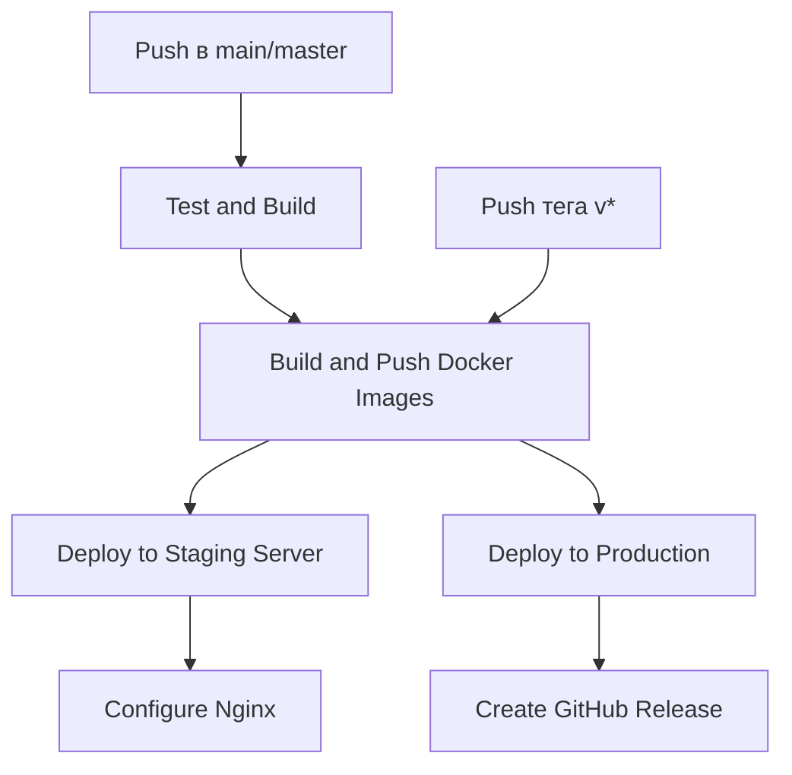

### Jobs и их назначение

| Job | Назначение | Условия запуска |
|-----|------------|-----------------|
| **test** | Тестирование и компиляция Go-сервисов | Всегда |
| **docker-build** | Сборка и публикация Docker-образов | main/master, теги v* |
| **deploy-staging** | Деплой на сервер | main/master |
| **configure-nginx** | Настройка nginx на сервере | main/master |
| **deploy-production** | Деплой production версии | теги v* |

---

## Реализация pipeline

### Файл `.github/workflows/ci-cd.yml`

Ключевые этапы пайплайна:

```yaml
name: CI/CD Pipeline

on:
  push:
    branches: [ main, master, develop ]
  pull_request:
    branches: [ main, master ]

env:
  GO_VERSION: '1.22'
  REGISTRY: ghcr.io
  DEPLOY_PATH: /opt/mirea-tip/24
  NGINX_APPS_AVAILABLE: /etc/nginx/apps-available/mirea-tip-24.conf
  NGINX_APPS_ENABLED: /etc/nginx/apps-enabled/mirea-tip-24.conf

jobs:
  test:
    name: Test and Build
    runs-on: ubuntu-latest
    permissions:
      contents: read

    steps:
      - name: Checkout repository
        uses: actions/checkout@v4

      - name: Set up Go
        uses: actions/setup-go@v5
        with:
          go-version: ${{ env.GO_VERSION }}

      - name: Create vendor for Auth
        working-directory: ./tech-ip-sem2/services/auth
        run: |
          go mod download
          go mod vendor

      - name: Create vendor for Tasks
        working-directory: ./tech-ip-sem2/services/tasks
        run: |
          go mod download
          go mod vendor

      - name: Run tests
        working-directory: ./tech-ip-sem2/services/auth
        run: go test ./... -v
        continue-on-error: true

      - name: Build services
        run: |
          cd tech-ip-sem2/services/auth && go build -v -o bin/auth ./cmd/auth
          cd ../tasks && go build -v -o bin/tasks ./cmd/tasks

      - name: Upload build artifacts
        uses: actions/upload-artifact@v4
        with:
          name: binaries
          path: |
            tech-ip-sem2/services/auth/bin/auth
            tech-ip-sem2/services/tasks/bin/tasks
```

### Сборка и публикация Docker-образов

```yaml
docker-build:
  name: Build and Push Docker Images
  runs-on: ubuntu-latest
  needs: test
  if: github.ref == 'refs/heads/main' || github.ref == 'refs/heads/master' || startsWith(github.ref, 'refs/tags/v')
  permissions:
    contents: read
    packages: write

  steps:
    - name: Set lowercase variables
      id: string
      run: |
        echo "lowercase_owner=${GITHUB_REPOSITORY_OWNER,,}" >> $GITHUB_OUTPUT
        REPO_NAME=$(echo "${GITHUB_REPOSITORY}" | cut -d'/' -f2)
        echo "lowercase_repo=${REPO_NAME,,}" >> $GITHUB_OUTPUT

    - name: Set up Docker Buildx
      uses: docker/setup-buildx-action@v3

    - name: Login to GitHub Container Registry
      uses: docker/login-action@v3
      with:
        registry: ${{ env.REGISTRY }}
        username: ${{ github.actor }}
        password: ${{ secrets.GITHUB_TOKEN }}

    - name: Build and push Auth Docker image
      uses: docker/build-push-action@v5
      with:
        context: ./tech-ip-sem2/services/auth
        file: ./tech-ip-sem2/services/auth/Dockerfile
        push: true
        tags: |
          ${{ env.REGISTRY }}/${{ steps.string.outputs.lowercase_owner }}/${{ steps.string.outputs.lowercase_repo }}/auth:${{ github.sha }}
          ${{ env.REGISTRY }}/${{ steps.string.outputs.lowercase_owner }}/${{ steps.string.outputs.lowercase_repo }}/auth:latest
```

---

## Секреты и переменные окружения

### Переменные окружения (в файле workflow)

| Переменная | Значение | Назначение |
|------------|----------|------------|
| `GO_VERSION` | `1.22` | Версия Go для сборки |
| `REGISTRY` | `ghcr.io` | Регистри для Docker-образов |
| `DEPLOY_PATH` | `/opt/mirea-tip/24` | Путь на сервере для деплоя |
| `NGINX_APPS_AVAILABLE` | `/etc/nginx/apps-available/mirea-tip-24.conf` | Путь к конфигу nginx |

### Секреты GitHub (настраиваются в Settings → Secrets and variables → Actions)

| Секрет | Описание |
|--------|----------|
| `DEPLOY_HOST` | Адрес сервера (`denchik2376.fvds.ru`) |
| `DEPLOY_USER` | Имя пользователя для SSH |
| `DEPLOY_SSH_KEY` | Приватный SSH ключ |
| `DB_PASSWORD` | Пароль для PostgreSQL |
| `GITHUB_TOKEN` | Автоматически создаётся GitHub |

---

## Деплой на сервер

### Job `deploy-staging`

```yaml
deploy-staging:
  name: Deploy to Staging Server
  runs-on: ubuntu-latest
  needs: docker-build
  if: github.ref == 'refs/heads/main' || github.ref == 'refs/heads/master'

  steps:
    - name: Install SSH key
      uses: shimataro/ssh-key-action@v2
      with:
        key: ${{ secrets.DEPLOY_SSH_KEY }}
        known_hosts: ${{ secrets.DEPLOY_HOST }}

    - name: Copy files to server
      run: |
        scp -r tech-ip-sem2/deploy/migrations ${{ secrets.DEPLOY_USER }}@${{ secrets.DEPLOY_HOST }}:${{ env.DEPLOY_PATH }}/
        scp deploy/docker-compose.prod.yml ${{ secrets.DEPLOY_USER }}@${{ secrets.DEPLOY_HOST }}:${{ env.DEPLOY_PATH }}/docker-compose.yml

    - name: Create .env file
      run: |
        ssh ${{ secrets.DEPLOY_USER }}@${{ secrets.DEPLOY_HOST }} "cat > ${{ env.DEPLOY_PATH }}/.env << 'EOF'
        DB_USER=tasks_user
        DB_PASSWORD=${{ secrets.DB_PASSWORD }}
        DB_NAME=tasks_db
        AUTH_IMAGE=${{ env.REGISTRY }}/${{ steps.string.outputs.lowercase_owner }}/${{ steps.string.outputs.lowercase_repo }}/auth:${{ github.sha }}
        TASKS_IMAGE=${{ env.REGISTRY }}/${{ steps.string.outputs.lowercase_owner }}/${{ steps.string.outputs.lowercase_repo }}/tasks:${{ github.sha }}
        EOF"

    - name: Deploy containers
      run: |
        ssh ${{ secrets.DEPLOY_USER }}@${{ secrets.DEPLOY_HOST }} << 'EOF'
          cd ${{ env.DEPLOY_PATH }}
          docker login ${{ env.REGISTRY }} -u ${{ github.actor }} --password-stdin <<< "${{ secrets.GITHUB_TOKEN }}"
          docker-compose pull
          docker-compose down --remove-orphans || true
          docker-compose up -d
          docker image prune -f
        EOF
```

### Job `configure-nginx`

```yaml
configure-nginx:
  name: Configure Nginx
  runs-on: ubuntu-latest
  needs: deploy-staging

  steps:
    - name: Copy nginx config
      run: |
        scp deploy/nginx/mirea-tip-24.conf ${{ secrets.DEPLOY_USER }}@${{ secrets.DEPLOY_HOST }}:${{ env.NGINX_APPS_AVAILABLE }}

    - name: Enable and reload nginx
      run: |
        ssh ${{ secrets.DEPLOY_USER }}@${{ secrets.DEPLOY_HOST }} << 'EOF'
          ln -sf ${{ env.NGINX_APPS_AVAILABLE }} ${{ env.NGINX_APPS_ENABLED }}
          nginx -t && systemctl reload nginx
        EOF
```

---

## Настройка nginx

### Конфигурация `deploy/nginx/mirea-tip-24.conf`

```nginx
location /MIREA/TIP-Practice/24/ {
    # Прокси на Auth service для /v1/auth/
    location /MIREA/TIP-Practice/24/v1/auth/ {
        proxy_pass http://127.0.0.1:8081/v1/auth/;
        proxy_set_header Host $host;
        proxy_set_header X-Real-IP $remote_addr;
        proxy_set_header X-Forwarded-For $proxy_add_x_forwarded_for;
        proxy_set_header X-Forwarded-Proto $scheme;
        proxy_set_header X-Forwarded-Prefix /MIREA/TIP-Practice/24/v1/auth;
        proxy_set_header Authorization $http_authorization;
        proxy_set_header X-Request-ID $http_x_request_id;
        proxy_set_header Content-Type $http_content_type;
    }

    # Все остальные запросы на Tasks service
    proxy_pass http://127.0.0.1:8092/;
    proxy_set_header Host $host;
    proxy_set_header X-Real-IP $remote_addr;
    proxy_set_header X-Forwarded-For $proxy_add_x_forwarded_for;
    proxy_set_header X-Forwarded-Proto $scheme;
    proxy_set_header X-Forwarded-Prefix /MIREA/TIP-Practice/24;
    proxy_set_header Authorization $http_authorization;
    proxy_set_header X-Request-ID $http_x_request_id;
    proxy_set_header Content-Type $http_content_type;
}
```

### Маршрутизация запросов

| Внешний URL | Внутренний адрес |
|-------------|------------------|
| `http://denchik2376.fvds.ru/MIREA/TIP-Practice/24/v1/auth/login` | `http://127.0.0.1:8081/v1/auth/login` |
| `http://denchik2376.fvds.ru/MIREA/TIP-Practice/24/v1/tasks` | `http://127.0.0.1:8092/v1/tasks` |
| `http://denchik2376.fvds.ru/MIREA/TIP-Practice/24/metrics` | `http://127.0.0.1:8092/metrics` |

---

## Скриншоты выполнения

### 1. Успешный прогон пайплайна в GitHub Actions

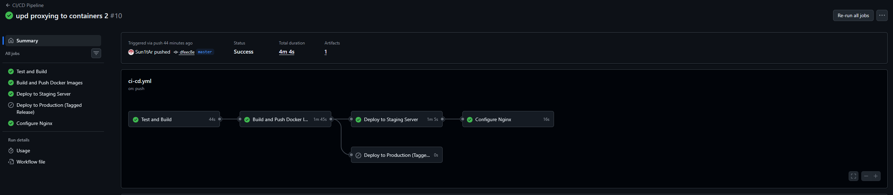

### 2. Job "Test and Build" с деталями

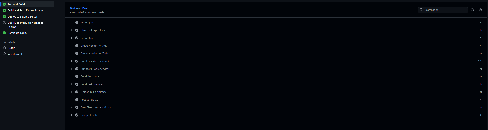

### 3. Job "Build and Push Docker Images"

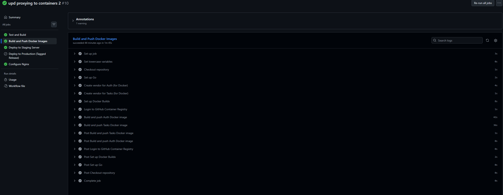

### 4. Job "Deploy to Staging Server"

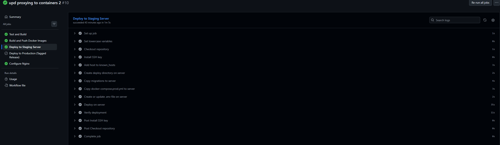

### 5. Job "Configure Nginx"

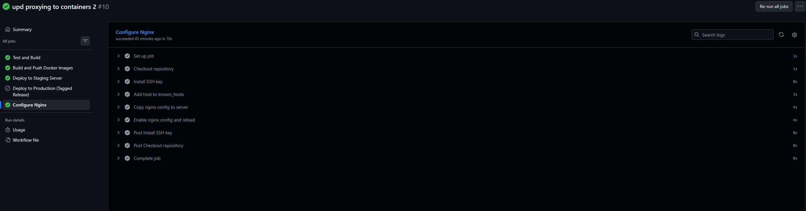

### 6. Запущенные контейнеры на сервере

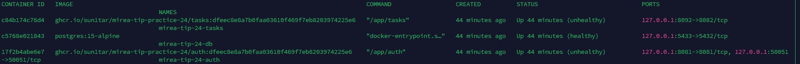

### 7. Секреты в настройках репозитория

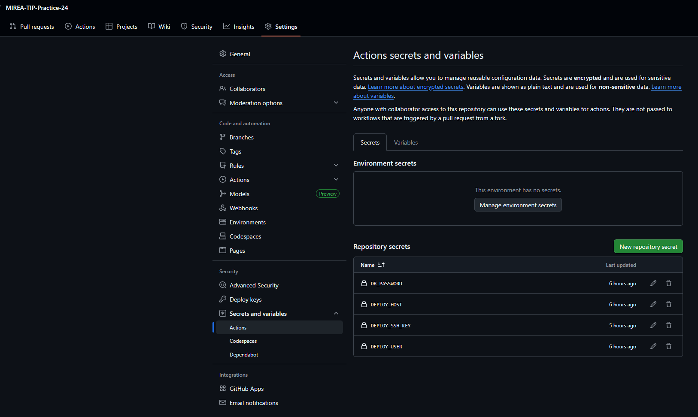

### 8. Успешный логин через Postman

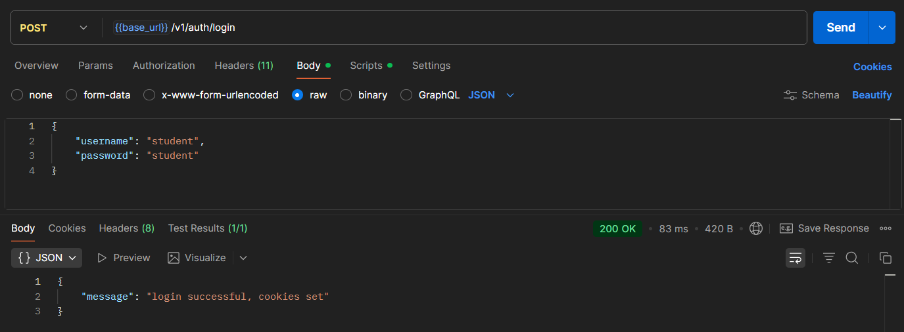

### 9. Создание задачи через Postman

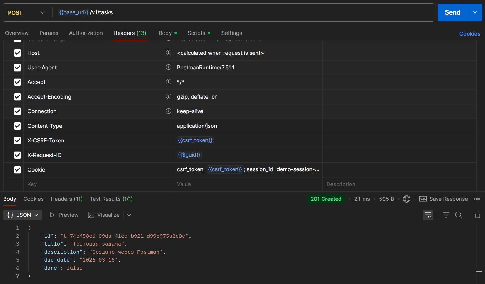

### 10. Метрики Prometheus

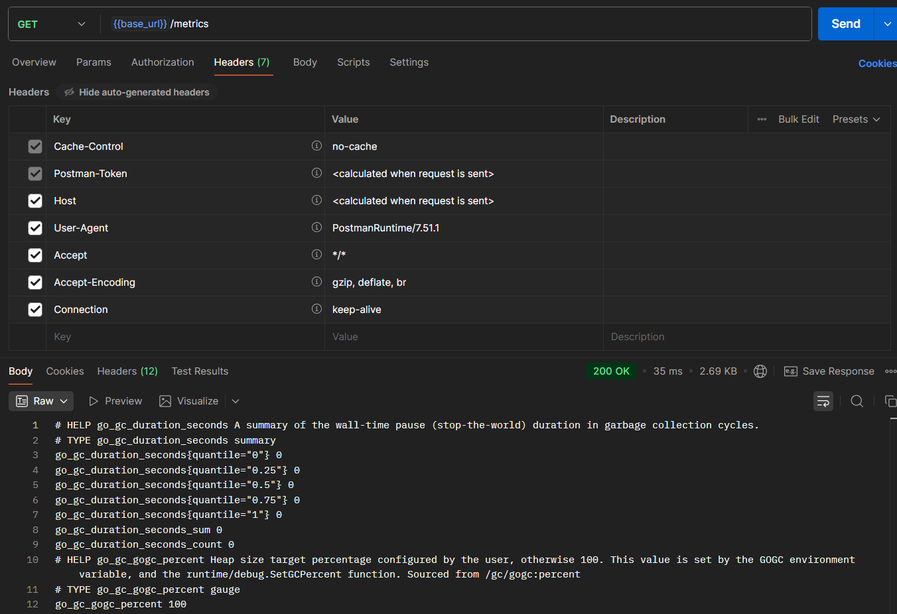

---

## Выводы

В ходе выполнения практического занятия №24 были достигнуты следующие результаты:

### CI/CD пайплайн
1. **Реализован полноценный пайплайн** в GitHub Actions с пятью jobs: тестирование, сборка образов, деплой на staging, настройка nginx, деплой production.
2. **Автоматизирована сборка** Go-сервисов с использованием vendor для воспроизводимости.
3. **Настроена публикация Docker-образов** в GitHub Container Registry (GHCR) с правильной системой тегирования (SHA коммита и latest).
4. **Решена проблема регистра** — все имена репозиториев приведены к нижнему регистру с помощью встроенных функций GitHub Actions.

### Деплой на сервер
1. **Настроено SSH-подключение** с использованием ssh-agent для безопасного доступа к серверу.
2. **Автоматизировано копирование** файлов конфигурации (docker-compose, миграции) на сервер.
3. **Динамическое создание `.env` файла** с использованием секретов GitHub для конфиденциальных данных.
4. **Успешный запуск контейнеров** через `docker-compose` с обновлением образов.

### Инфраструктура
1. **Настроен nginx** как единая точка входа с проксированием на внутренние сервисы по подпутям:
    - `/v1/auth/*` → Auth service (порт 8081)
    - `/*` → Tasks service (порт 8092)
2. **Обеспечена изоляция портов** — все сервисы слушают только localhost, наружу смотрит только nginx.
3. **Добавлена собственная PostgreSQL** на порту 5433, не конфликтующая с существующей БД на сервере.

### Безопасность
1. **Все секреты хранятся в GitHub Secrets** — ни один пароль или ключ не попал в репозиторий.
2. **SSH-ключи настроены** с правильными правами доступа.
3. **CSRF-защита** сохранена и корректно работает через cookies.

### Результаты
- ✅ Пайплайн успешно проходит при каждом push в main/master
- ✅ Docker-образы публикуются в GHCR
- ✅ Приложение разворачивается на сервере автоматически
- ✅ API доступно по адресу `http://denchik2376.fvds.ru/MIREA/TIP-Practice/24`
- ✅ Все эндпоинты работают корректно

Таким образом, проект полностью готов к непрерывной поставке (Continuous Delivery) и может быть легко масштабирован или доработан.

---

## Контрольные вопросы

### 1. Чем CI отличается от CD?

**CI (Continuous Integration)** — непрерывная интеграция. Это процесс автоматической сборки и тестирования кода при каждом изменении. Цель — быстро обнаружить ошибки интеграции. Включает этапы: checkout, установка зависимостей, компиляция, запуск тестов.

**CD (Continuous Delivery/Deployment)** — непрерывная доставка/развёртывание. Это процесс автоматического развёртывания протестированного кода в окружения (staging/production). Включает этапы: сборка Docker-образов, публикация в registry, деплой на сервер, настройка инфраструктуры.

В данном проекте:
- **CI** — job `test` (компиляция и тесты)
- **CD** — jobs `docker-build`, `deploy-staging`, `configure-nginx`, `deploy-production`

### 2. Почему go test должен запускаться в pipeline?

`go test` должен запускаться в pipeline по нескольким причинам:
- **Автоматизация** — исключает человеческий фактор, тесты запускаются при каждом изменении
- **Раннее обнаружение ошибок** — проблемы выявляются сразу после пуша, а не перед релизом
- **Гарантия качества** — в main/master попадает только протестированный код
- **Регрессионное тестирование** — старые тесты проверяют, что новый код не сломал старую функциональность
- **Документация** — тесты служат живой документацией ожидаемого поведения

### 3. Что такое секреты CI и почему их нельзя хранить в репозитории?

Секреты CI — это конфиденциальные данные, необходимые для работы пайплайна, но не подлежащие публичному раскрытию: пароли, токены, SSH-ключи, ключи API.

**Их нельзя хранить в репозитории потому что:**
- **Безопасность** — репозиторий может быть публичным или доступен многим разработчикам
- **История** — даже если удалить секрет из файла, он останется в истории коммитов
- **Компрометация** — при утечке репозитория все секреты становятся известны злоумышленникам
- **Аудит** — сложно отследить, кто и когда использовал секрет

Вместо этого секреты хранятся в защищённом хранилище (GitHub Secrets) и подставляются в пайплайн только во время выполнения.

### 4. Почему важно версионировать docker-образы?

Версионирование Docker-образов необходимо для:
- **Воспроизводимости** — можно точно знать, какая версия кода запущена
- **Отката** — при проблемах легко вернуться на предыдущую версию
- **Трассировки** — по тегу можно определить коммит, который породил образ
- **Тестирования** — можно развернуть конкретную версию для тестирования
- **Совместимости** — разные окружения могут использовать разные версии

В проекте используется два тега:
- `:latest` — последняя стабильная версия
- `:{sha}` — точная версия, соответствующая коммиту

### 5. Какие риски у автоматического деплоя без ручного контроля?

Автоматический деплой без ручного контроля несёт следующие риски:
- **Выкатка багов** — ошибочный код может сразу попасть в продакшен
- **Каскадные сбои** — проблема в одном сервисе может нарушить работу всех
- **Потеря данных** — некорректные миграции БД могут уничтожить данные
- **Отсутствие проверки** — могут быть пропущены нефункциональные требования (производительность, безопасность)
- **Сложность отката** — автоматический откат может быть сложнее, чем деплой

**Меры снижения рисков:**
- Staging окружение для финального тестирования
- Canary deployments (постепенный выкат)
- Feature flags (включение функциональности по флагу)
- Автоматические тесты и проверки перед деплоем
- Мониторинг и алертинг после деплоя

В проекте используется staging деплой (в `main/master`) и production деплой (только по тегам `v*`), что даёт возможность провести финальное ручное тестирование перед релизом.
